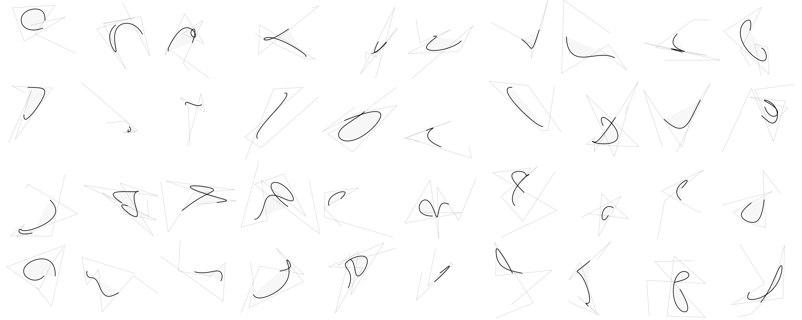

# gogr



Needed things
---
  * [Nix](https://nixos.org/nix/)

Quick start
---
```
$ nix-shell
[nix-shell:path/to/gogr]$ ./test src/test/
[nix-shell:path/to/gogr]$ ./test src/test/ prof
[nix-shell:path/to/gogr]$ go run main.go && open out/main.png
```
